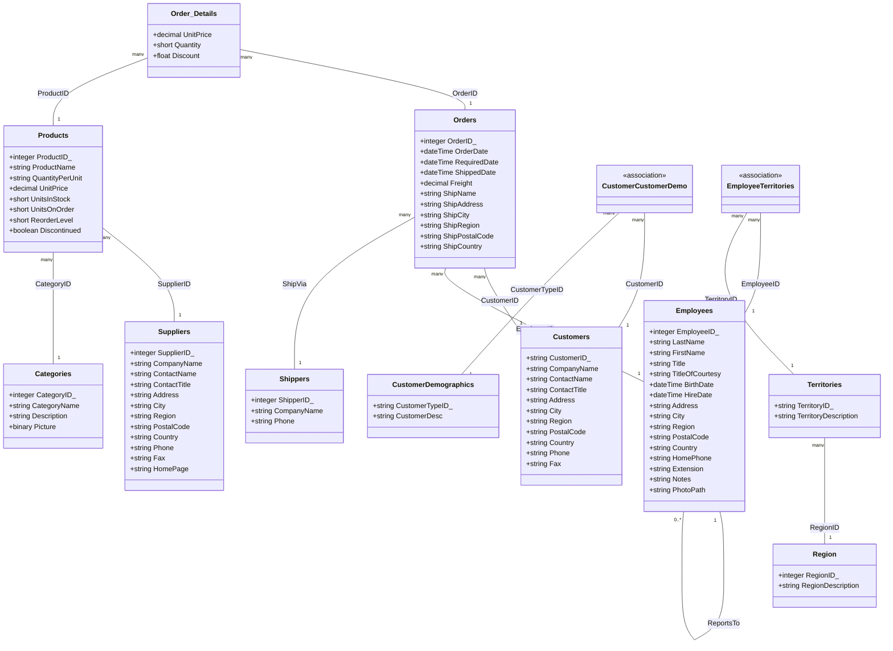

## Northwind Ontology

```mermaid
classDiagram
    class Employees {
        +integer EmployeeID_
        +string LastName
        +string FirstName
        +string Title
        +string TitleOfCourtesy
        +dateTime BirthDate
        +dateTime HireDate
        +string Address
        +string City
        +string Region
        +string PostalCode
        +string Country
        +string HomePhone
        +string Extension
        +string Notes
        +string PhotoPath
    }

    class Categories {
        +integer CategoryID_
        +string CategoryName
        +string Description
        +binary Picture
    }

    class Customers {
        +string CustomerID_
        +string CompanyName
        +string ContactName
        +string ContactTitle
        +string Address
        +string City
        +string Region
        +string PostalCode
        +string Country
        +string Phone
        +string Fax
    }

    class Shippers {
        +integer ShipperID_
        +string CompanyName
        +string Phone
    }

    class Suppliers {
        +integer SupplierID_
        +string CompanyName
        +string ContactName
        +string ContactTitle
        +string Address
        +string City
        +string Region
        +string PostalCode
        +string Country
        +string Phone
        +string Fax
        +string HomePage
    }

    class Orders {
        +integer OrderID_
        +dateTime OrderDate
        +dateTime RequiredDate
        +dateTime ShippedDate
        +decimal Freight
        +string ShipName
        +string ShipAddress
        +string ShipCity
        +string ShipRegion
        +string ShipPostalCode
        +string ShipCountry
    }

    class Products {
        +integer ProductID_
        +string ProductName
        +string QuantityPerUnit
        +decimal UnitPrice
        +short UnitsInStock
        +short UnitsOnOrder
        +short ReorderLevel
        +boolean Discontinued
    }

    class Order_Details {
        +decimal UnitPrice
        +short Quantity
        +float Discount
    }

    class CustomerCustomerDemo {
        <<association>>
    }

    class CustomerDemographics {
        +string CustomerTypeID_
        +string CustomerDesc
    }

    class Region {
        +integer RegionID_
        +string RegionDescription
    }

    class Territories {
        +string TerritoryID_
        +string TerritoryDescription
    }

    class EmployeeTerritories {
        <<association>>
    }

    %% --- Relationships ---
    Employees "1" -- "0..*" Employees : ReportsTo
    Orders "many" -- "1" Customers : CustomerID
    Orders "many" -- "1" Employees : EmployeeID
    Orders "many" -- "1" Shippers : ShipVia
    Products "many" -- "1" Suppliers : SupplierID
    Products "many" -- "1" Categories : CategoryID
    Territories "many" -- "1" Region : RegionID

    %% --- Association Classes for Many-to-Many Relationships ---
    Order_Details "many" -- "1" Orders : OrderID
    Order_Details "many" -- "1" Products : ProductID

    EmployeeTerritories "many" -- "1" Employees : EmployeeID
    EmployeeTerritories "many" -- "1" Territories : TerritoryID

    CustomerCustomerDemo "many" -- "1" Customers : CustomerID
    CustomerCustomerDemo "many" -- "1" CustomerDemographics : CustomerTypeID
```