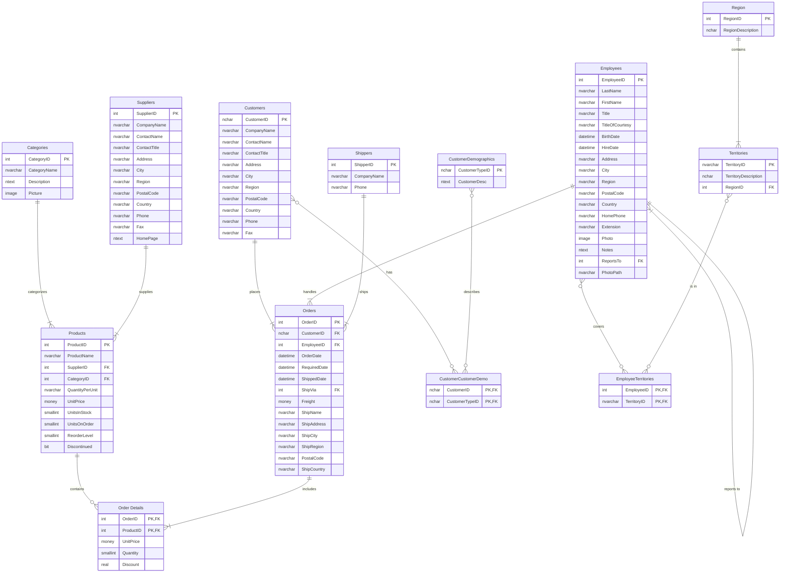

## Northwind ERD

```mermaid
erDiagram
    Employees {
        int EmployeeID PK
        nvarchar LastName
        nvarchar FirstName
        nvarchar Title
        nvarchar TitleOfCourtesy
        datetime BirthDate
        datetime HireDate
        nvarchar Address
        nvarchar City
        nvarchar Region
        nvarchar PostalCode
        nvarchar Country
        nvarchar HomePhone
        nvarchar Extension
        image Photo
        ntext Notes
        int ReportsTo FK
        nvarchar PhotoPath
    }
    Categories {
        int CategoryID PK
        nvarchar CategoryName
        ntext Description
        image Picture
    }
    Customers {
        nchar CustomerID PK
        nvarchar CompanyName
        nvarchar ContactName
        nvarchar ContactTitle
        nvarchar Address
        nvarchar City
        nvarchar Region
        nvarchar PostalCode
        nvarchar Country
        nvarchar Phone
        nvarchar Fax
    }
    Shippers {
        int ShipperID PK
        nvarchar CompanyName
        nvarchar Phone
    }
    Suppliers {
        int SupplierID PK
        nvarchar CompanyName
        nvarchar ContactName
        nvarchar ContactTitle
        nvarchar Address
        nvarchar City
        nvarchar Region
        nvarchar PostalCode
        nvarchar Country
        nvarchar Phone
        nvarchar Fax
        ntext HomePage
    }
    Orders {
        int OrderID PK
        nchar CustomerID FK
        int EmployeeID FK
        datetime OrderDate
        datetime RequiredDate
        datetime ShippedDate
        int ShipVia FK
        money Freight
        nvarchar ShipName
        nvarchar ShipAddress
        nvarchar ShipCity
        nvarchar ShipRegion
        nvarchar PostalCode
        nvarchar ShipCountry
    }
    Products {
        int ProductID PK
        nvarchar ProductName
        int SupplierID FK
        int CategoryID FK
        nvarchar QuantityPerUnit
        money UnitPrice
        smallint UnitsInStock
        smallint UnitsOnOrder
        smallint ReorderLevel
        bit Discontinued
    }
    "Order Details" {
        int OrderID PK, FK
        int ProductID PK, FK
        money UnitPrice
        smallint Quantity
        real Discount
    }
    CustomerCustomerDemo {
        nchar CustomerID PK, FK
        nchar CustomerTypeID PK, FK
    }
    CustomerDemographics {
        nchar CustomerTypeID PK
        ntext CustomerDesc
    }
    Region {
        int RegionID PK
        nchar RegionDescription
    }
    Territories {
        nvarchar TerritoryID PK
        nchar TerritoryDescription
        int RegionID FK
    }
    EmployeeTerritories {
        int EmployeeID PK, FK
        nvarchar TerritoryID PK, FK
    }

    Customers ||--|{ Orders : places
    Employees ||--|{ Orders : handles
    Shippers ||--|{ Orders : ships
    Products ||--o{ "Order Details" : contains
    Orders ||--|{ "Order Details" : includes
    Categories ||--|{ Products : categorizes
    Suppliers ||--|{ Products : supplies
    Employees }|--|| Employees : "reports to"
    Region ||--|{ Territories : contains
    Employees }o--o{ EmployeeTerritories : covers
    Territories }o--o{ EmployeeTerritories : "is in"
    Customers }o--o{ CustomerCustomerDemo : has
    CustomerDemographics }o--o{ CustomerCustomerDemo : describes
```